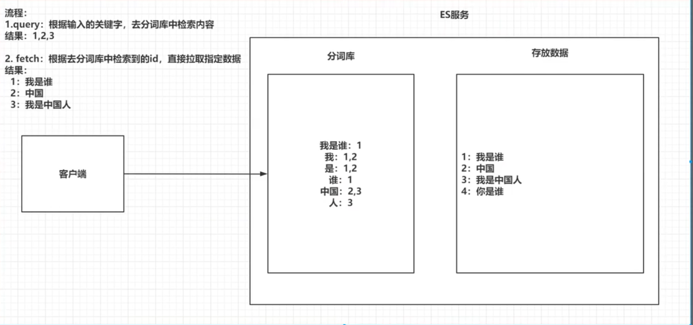
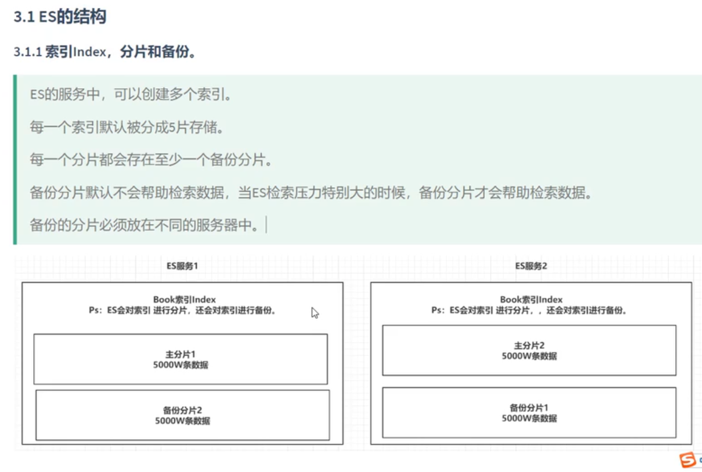
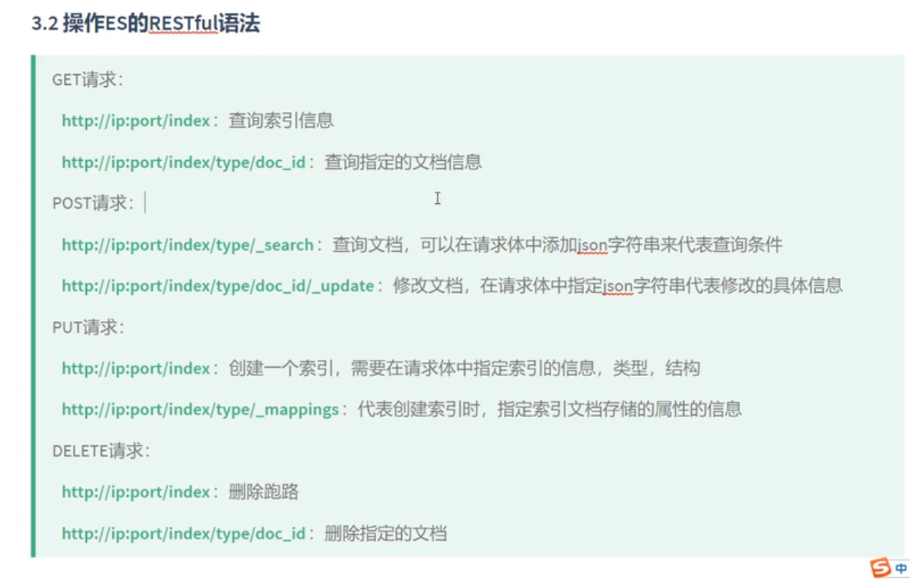
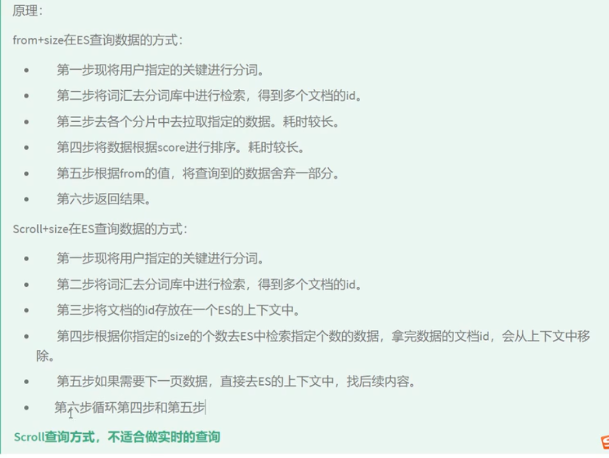
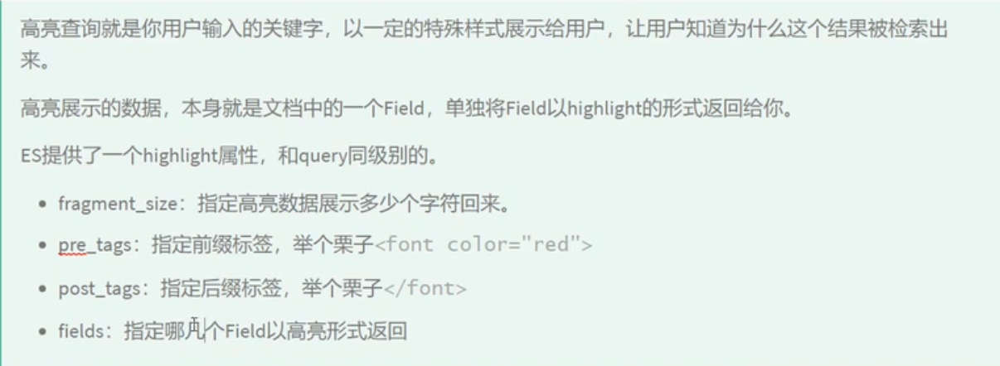

### 倒排索引




### 安装elasticsearch

http://hub.daocloud.io/

```yam
version: "3.1"
services:
 elasticsearch:
      image: elasticsearch:6.5.4
      restart: always
      container_name: elasticsearch-6.5.4
      environment:
        - cluster.name=elasticsearch-default
        - discovery.type=single-node
      volumes:
         - /docker-soft/docker-es/es/es-data:/usr/share/elasticsearch/data
      ports:
        - 9200:9200
 kibana:
     image: kibana:6.5.4
     restart: always
     container_name: kibana-6.5.4
     ports:
      - 5601:5601
     environment:
        - ELASTICSEARCH_URL=http://elasticsearch:9200
        - /docker-soft/docker-es/kibana/kibana.yml:/usr/share/kibana/config/kibana.yml
     depends_on:
       - elasticsearch
     links:
       - elasticsearch
 


```

### 安装分词器


```ssh
./bin/elasticsearch-plugin install https://github.com/medcl/elasticsearch-analysis-ik/releases/download/v6.5.4/elasticsearch-analysis-ik-6.5.4.zip
```

### Es 的存储结构



### restfull 操作



### 查询

#### 1 term 查询

> term 查询完全匹配查询，搜索之前不会对关键词进行分词。

```json

##1 term 查询
POST /person/man/_search
{
  "from": 0,
  "size": 10,
  "query": {
    "term": {
      "sex": {
        "value": "男"
      }
    }
  }
}
```


#### 2 terms 查询

> 相当与mysql 中的 in()

```jso
POST /person/man/_search
{
  "from": 0,
  "size": 10,
  "query": {
      "terms": {
        "sex": [
          "男",
          "女"
        ]
      }
  }
}

```

#### 4 match


##### 4.1 match_all

```json
查询所有
POST /person/man/_search
{
"from": 0,
"size": 10,
"query": {
"match_all": {}
}
}
```


#### 4.2 match 

```json
POST /person/man/_search
{
"query": {
"match": {
 "des": "股份"
}
}
}
```

###### 4.2.1 带布尔的match 查询

operator 默认为and

```json

POST /person/man/_search
{
  "query": {
    "match": {
      "des": {
        "query": "股份 韩国",
        "operator": "or"
      }
    }
  }
}

```

#### 4.3 multi_match

> 一个 text 对应多个 f ields

```json
POST /person/man/_search
{
  "query": {
    "multi_match": {
      "query": "坦然 北京",
      "fields": ["address","des"]
    }
  }
}
```

#### 4.4 ids

```json
POST /person/man/_search
{
  "query": {
    "ids": {
      "values": [
        "1",
        "2",
        "3"
      ]
    }
  }
}

```

#### 4.5 prefix

> 前缀查询

```json
POST /person/man/_search
{
  "query": {
     "prefix": {
       "des": {
         "value": "韩"
       }
     }
  }
}
```

#### 4.6 fuzzy


#### 4.7 wildcard

> 通配符查询 

```json
POST /person/man/_search
{
  "query": {
       "wildcard": {
         "name": {
           "value": "王*"
         }
       }
  }
}
```

#### 4.8 range 查询

> 范围查询，只针对数值

```json
POST /person/man/_search
{
  "query": {
       "range": {
         "age": {
           "gte": 30,
           "lte": 32
         }
       }
  }
}
```

#### 4.9 regexp


```json
POST /person/man/_search
{
  "query": {
       "regexp": {
         "address": "北京*"
       }
  }
}
```

#### 4.10 scroll 深分页

> ES 对from + size 是有限制的，from + size 之和不能大于1万



```json

POST /person/man/_search?scroll=2m
{
  "query": {
    "match_all": {}
    
  },
  "size": 5,
  "sort": [
    {
      "id": {
        "order": "asc"
      }
    }
  ]
}


POST /_search/scroll
{
   "scroll_id":"DnF1ZXJ5VGhlbkZldGNoBQAAAAAAAAYGFlgwMF9TcDBoUml1VFJSeVlKRjY2NGcAAAAAAAAGBBZYMDBfU3AwaFJpdVRSUnlZSkY2NjRnAAAAAAAABgUWWDAwX1NwMGhSaXVUUlJ5WUpGNjY0ZwAAAAAAAAYDFlgwMF9TcDBoUml1VFJSeVlKRjY2NGcAAAAAAAAGAhZYMDBfU3AwaFJpdVRSUnlZSkY2NjRn",
   "scroll":"2m"
}

DELETE /_search/scroll/DnF1ZXJ5VGhlbkZldGNoBQAAAAAAAAYGFlgwMF9TcDBoUml1VFJSeVlKRjY2NGcAAAAAAAAGBBZYMDBfU3AwaFJpdVRSUnlZSkY2NjRnAAAAAAAABgUWWDAwX1NwMGhSaXVUUlJ5WUpGNjY0ZwAAAAAAAAYDFlgwMF9TcDBoUml1VFJSeVlKRjY2NGcAAAAAAAAGAhZYMDBfU3AwaFJpdVRSUnlZSkY2NjRn

```

#### 4.11 delete_by_query

> 根据查询删除，不适合大量数据删除

```json
 
POST /person/man/_delete_by_query
{
  "query": {
    "range": {
      "id": {
        "lte": 2
      }
    }
  }
}
```

#### 4.12 组合查询

##### 4.12.1 boolean


```json
POST /person/man/_search
{
  "query": {
    "bool": {
      "must": [
        {
          "match": {
            "name": "黄磊"
          }
        },
        {
          "range": {
            "age": {
              "gte": 32
            }
          }
        },
        {
          "term": {
            "sex": {
              "value": "男"
            }
          }
        }
      ],
      "should": [
        {}
      ],
      "must_not": [
        {}
      ]
    }
  }
}
```

##### 4.12.2 booting


```json

POST /person/man/_search
{
  "query": {
    "boosting": {
      "positive": {
        "match": {
          "address": "北京"
        }
      },
      "negative": {
        "match": {
          "name": "国庆"
        }
      },
      "negative_boost": 0.5
    }
  }
}
```

#### 4.13 filter


```json
POST /person/man/_search
{
  "query": {
    "bool": {
      "filter": [
        {
          "term": {
            "sex": "女"
          }
        },
        {
          "range": {
             "age":{
               "lte": 32
             }
          }
        }
      ]
    }
  }
}
```

#### 4.14 高亮查询



```json
POST /person/man/_search
{
  "query": {
    "match": {
      "address": "北京"
    }
  },
  "highlight": {
    "fields": {
      "address": {}
    },
    "pre_tags": "<font color='red'>",
    "post_tags": "</font>",
    "fragment_size": 10
  }
}

```

#### 4.15 聚合查询


##### 4.15.1 去重查询


```json
POST /person/man/_search
{
  "aggs": {
    "province_num": {
      "cardinality": {
        "field": "province"
      }
    }
  }
}

```

##### 4.15.2 range


```json

## 聚合查询 range
POST /person/man/_search
{
  "aggs": {
    "num": {
      "range": {
        "field": "age",
        "ranges": [
          {
            "from": 20,
            "to": 30
          }
        ]
      }
    }
  }
}

## 聚合查询 date_range
POST /person/man/_search
{
  "aggs": {
    "date":{
      "date_range": {
        "field": "birthday",
        "format": "yyyy", 
        "ranges": [
          {
            "from": "1990", 
            "to": "2000"
          } 
        ]
      }
    }
  }
}
## 聚合查询 ip_range
POST /person/man/_search
{
  "aggs": {
    "ip_range": {
      "ip_range": {
        "field": "ipAddr",
        "ranges": [
          {
            "from": "192.168.2.1",
            "to":"192.168.2.5"
          } 
        ]
      }
    }
  }
}
```

#### 4.15.3 统计聚合查询


```json
POST /person/man/_search
{
  "aggs": {
    "agee": {
      "extended_stats": {
        "field": "age"
      }
    }
  }
}
```


